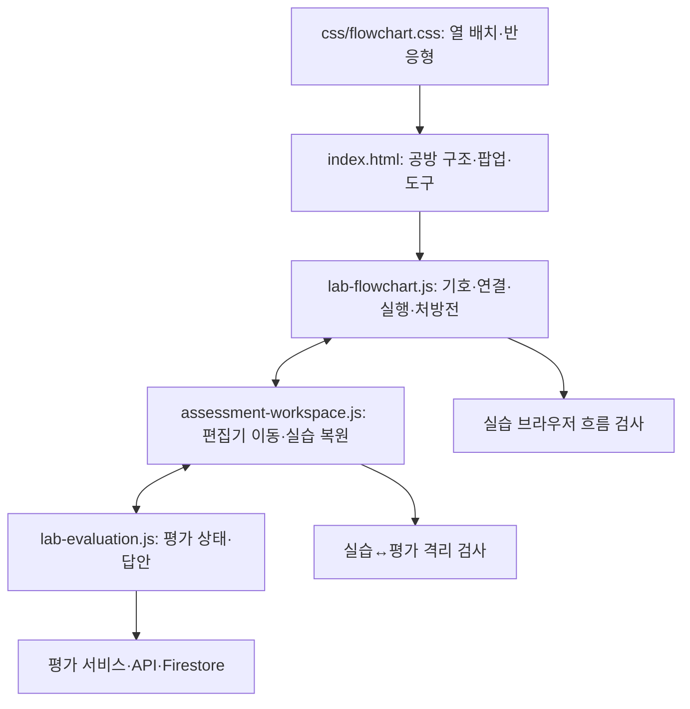
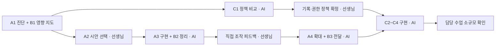

# 공방 UX 진단과 발전 계획

갱신: 2026-09-19. 제품 기준 `5ada837`, 작업 브랜치 `codex/workshop-ux-discovery`.
첫 착수 범위는 **제품 변경 없는 A1 진단·A2 비교 시안·B1 영향 지도**입니다. 전체 로드맵 구현 완료가 아닙니다.

## 직접 비교하기

[조작 가능한 A/B 시안](ux/workshop-preview.html)을 브라우저로 엽니다. 파일만으로도 동작하며 설치·서버·로그인이 필요 없습니다.

| 안 | 바뀌는 배치 | 장점 | 확인할 부담 |
|---|---|---|---|
| A · 익숙한 배치 — 권장 출발점 | 왼쪽 계획, 세로 기호, 오른쪽 캔버스; 좁은 창은 세로 전환 | 계획과 결과 대조가 쉽고 기존 수업 설명을 유지 | 작은 창에서 세로 이동이 길어짐 |
| B · 넓은 작업 공간 | 위쪽 접는 계획, 가로 기호, 넓은 캔버스 | 창 모드에서 조립 공간 확보 | 계획을 다시 펼쳐 보는 조작 필요 |

같은 예제를 유지한 채 A/B를 전환합니다. 기호 추가·이동·내용 수정·두 기호 연결·삭제, 계획 수정, 실행 과정 접기, 예시 강조 재생을 비교할 수 있습니다. 이는 사용감 시제품입니다. 기호 표현·연결 조작은 단순화했고, 실제 포트 연결·분기 계산·입력·정답 판정·AI·저장·평가 이동은 연결하지 않았습니다. 새로고침하면 초기화됩니다. 시제품의 새 조작을 제품에 그대로 적용하기로 확정한 것은 아닙니다.

선생님께서 판단하실 세 가지: **계획을 계속 보아야 하는가 / 주요 버튼을 바로 찾는가 / 좁은 창의 이동량이 괜찮은가**. A 또는 B, 혹은 “A의 계획 + B의 기호 배치”처럼 말씀해 주시면 다음 구현 범위로 정리합니다.

## A1. 관찰과 우선순위

격리된 로컬 demo, Edge headless, 2026-09-19 관찰입니다. Firebase 설정을 무효화하고 API를 제공하지 않는 서버에서 확인했으며 실제 학생 자료를 사용하지 않았습니다.

| 우선 | 관찰된 사실 | 해석·제안 | 근거 |
|---|---|---|---|
| 높음 | 처방전 열기 후 초점이 창 안으로 이동하지 않고 Escape로 닫히지 않음. 닫기 버튼에 aria-label 없음 | 키보드 사용자는 창 진입·종료를 찾기 어려움. 초점 이동·복귀와 명시적 닫기 이름부터 개선 | 초기 진단 JSON의 prescription 항목, index.html의 prescription-modal |
| 높음 | 390px에서 기획서 y=1053, 기호 보관함 y=1651로 캔버스 아래 배치됨 | 기능이 숨겨진 것은 아님. 긴 스크롤 없이 기호와 계획을 찾도록 구조 조정 | 후속 JSON sections; css/flowchart.css 900px 이하 세로 배치 |
| 중간 | 901px에서 캔버스 폭 약376px, 900px에서는 약819px로 배치가 급전환 | 경계 폭에서 작업 연속성을 비교할 필요. 고정 열 구조 완화 검토 | 초기 JSON widths |
| 중간 | 390px에서 상단 탐색·도구 영역 때문에 캔버스 시작이 y606인 상태 관찰 | 정보 위계와 도구 줄바꿈을 정리. 상태·콘텐츠에 따라 높이는 달라짐 | 초기 JSON 및 current-390 이미지 |
| 취향·선택 | 계획 상시 표시와 넓은 캔버스 중 무엇이 더 편한지 | 오류로 단정하지 않고 두 시안으로 선택 | A/B 시안 |

초기 화면의 정적 캡처만 보고 기획서가 없다고 판정하지 않았습니다. 후속 DOM 위치 확인으로 아래쪽 배치임을 구분했습니다.

## 검증 범위와 한계

- 현재 제품: 처방전 날씨 예시 적용 후 계획 카드 3개·기호 2개와 닫힘 확인. 블록 내용 수정·마우스 이동, 실행 패널 키보드 열기·닫기와 초점 복귀 확인.
- 초기 4종 드래그 검사는 단말 추가 단계에서 수량이 증가하지 않아 중단했습니다. 후속에서 자료·판단·처리는 각각 1개 증가했습니다. 초기화 직후 블록 수가 예상과 달라 단말 드래그는 **재현 조건 추가 확인 필요**이며 제품 오류로 확정하지 않습니다.
- 시작→종료 자료를 코드로 주입한 실행은 두 차례 완주했습니다. 이는 실행 중 중단 검증을 대신하지 않습니다. 후속에서는 코드로 준비한 입력·판단 예제를 실제 입력창과 선택 버튼으로 조작해 완주했고, 마우스 포트 드래그로 연결 1개 생성도 확인했습니다. [실행 관찰](ux/evidence/runtime.json)을 참고합니다.
- 평가 어댑터에 모의 답안을 주입한 진입·이탈에서 실습 상태 복원 확인. 실제 로그인·평가 제출·실행 중 전환은 미확인입니다.
- 현재 화면 폭 1440→1024→901→900→768→600→430→390→768→1024→1440에서 페이지 가로 넘침 없음. 순간별 자동 크기 변경이며 사람이 연속 드래그한 창 크기 검증과는 구분합니다.
- 시안 A/B 각각 1440·1024·901·900·768·390px에서 페이지 가로 넘침 없음. 기호 추가·내용 수정, 처방전 초점·Escape 닫기, 예시 재생 중단 확인. 페이지 오류 0건.
- 기존 화면의 움직임 감소 설정에서 전환·애니메이션 시간 축소 확인. 720×450 논리 화면 검사는 실제 브라우저 200% 확대를 대신하지 않습니다.
- **남은 A1 확인:** 실행 중 중단·재실행, 실행 중 실습/평가 전환, 실제 200% 확대, 연속 수동 리사이즈. A3 착수 전 이 흐름을 재현하고 시안 결정으로 누락 검사가 사라지지 않도록 합니다. 교실 PC·학생 사용은 선생님 피드백 영역입니다.

[초기 관찰 JSON](ux/evidence/audit.json)의 `pass`는 함수가 예외 없이 끝났다는 뜻이며 UX 합격 판정이 아닙니다. 세부 `escapeClosed:false` 등과 위 해석을 우선합니다. [후속 관찰 JSON](ux/evidence/followup.json)과 [기존 390px](ux/evidence/current-390.png), [A 데스크톱](ux/evidence/mockup-a-1440.png), [B 좁은 창](ux/evidence/mockup-b-390.png)을 함께 보십시오.

## B1. 변경 영향 지도

| 수정 대상 | 관련 경로 | 필요한 검사 |
|---|---|---|
| 배치·팝업·초점 | index.html, css/flowchart.css, js/labs/lab-flowchart.js | 표시·닫기·키보드·창 크기·확대 |
| 블록·연결·실행 표시 | js/labs/lab-flowchart.js | 추가·이동·편집·포트 연결·입력·분기·중단·재실행 |
| 공통 편집기 이동 | js/core/assessment-workspace.js, js/labs/lab-evaluation.js | 왕복 복원·평가 제한·실행 중 전환 |
| 저장·권한 | 평가 서비스·API・Firestore 규칙 | 별도 범위. 정상·실패·재시도·복구 및 API/직접 DB 양쪽 권한 |

이번에는 위 제품 파일을 수정하지 않습니다. B2는 시안 구현에 필요한 표시 책임부터 작게 분리하고, 저장 형식·공개 API·채점 로직은 함께 바꾸지 않습니다.

## 전체 작업 상태와 역할

| 목표 | 제가 맡을 결과 | 선생님 역할 | 현재 상태·완료 조건 |
|---|---|---|---|
| A1 공방 진단 | 문제·재현 근거·미확인 목록 | 수업의 불편 보충 | 1차 진단 완료, 위 남은 흐름 추가 확인 |
| A2 공통 UX | 동일 내용의 두 조작 시안·추천 이유 | 방향·정보량·조작감 선택 | 시안 준비, 선택 대기 |
| A3 공방 구현 | 선택 반영·대표 흐름·회귀 검증 | 직접 조작 피드백 | 선택 후 착수; 주요 조작 접근·답안 격리 유지 |
| A4 화면 확대 | 평가·교사 화면의 공통 규칙 적용 | 역할별 적합성 판단 | A3 확인 후; 화면별 목적 유지 |
| B1 영향 지도 | 공유 구조와 검사 범위 | 중요한 운영 흐름 보충 | 1차 지도 작성 |
| B2 공통 코드 | UI에 필요한 표시·조작 책임 분리 | 사용자 동작 변경 확인 | A3와 진행; 기존 동작 유지 |
| B3 문서·전달 | 링크 검사·PR 확인·HANDOFF | 다른 PC의 혼란 전달 | 이번 기록부터 적용; 반복 절차 정착은 후속 |
| C1 식별·보존 | 접속·비용·권한·복구 추천안 비교 | 접속 방식·보관 기간·운영 절차 결정 | 설계 예정; 기존 자료 호환·복구까지 확정 |
| C2 오늘 수업 | 활동 지정·학생 진입 구현 | 수업 단위와 활동 지정 방식 | C1 후; 오늘 할 활동 발견 가능 |
| C3 이어하기·제출 | 저장·복원·실패 대응 | 재제출·마감·수업 후 접근 | 정책 후; 다른 PC 본인 작업 복구 |
| C4 결과·피드백 | 학생 결과·교사 제출 현황 | 공개할 결과·피드백 범위 | 정책 후; 본인·담당 교사 접근 유지 |

조사·설계·구현·기술 검증·문서·PR 준비는 제가 책임집니다. 교육 목적과 UX 경험, 개인정보·보관·비용·성적 정책, 해당 변경의 운영 반영은 선생님이 판단합니다. 피드백은 반영/대안 제안/후속 검토로 이유와 함께 기록합니다. 코드 검토나 도구 설치를 선생님께 요구하지 않습니다.

출결·채팅·영상·다른 교사 독립 가입은 제외합니다. 현 강사 권한, HTML/CSS/Vanilla JS·Firebase·Vercel과 기존 문항·답안·확정 성적은 유지합니다. 과거 문서 배포 승인을 이번 제품 변경의 배포 승인으로 확대하지 않습니다.
